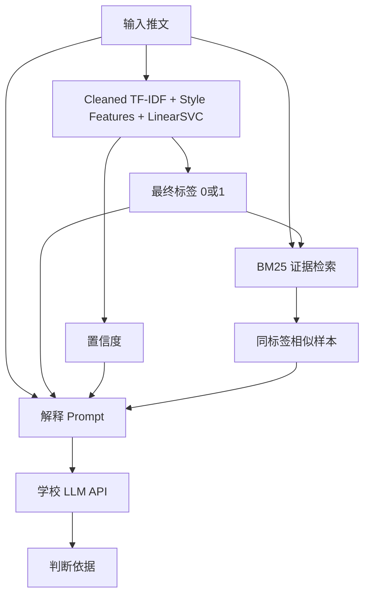

# 2026《人工智能导论》大作业 - 可解释的谣言检测

## 1. 项目目标

对社交媒体推文进行二分类：

* `0`：非谣言
* `1`：谣言

同时输出一段自然语言解释，说明判断依据。

当前采用 **本地监督学习分类器 + BM25 证据检索 + 学校 LLM 解释生成** 的复合架构。

其中：

* 本地分类器负责最终 `0/1` 检测结果；
* BM25 负责检索训练集中相似样本，作为解释依据；
* 学校 LLM API 只负责生成自然语言解释，不参与最终分类。

当前最终分类器为：

```text
Cleaned TF-IDF + Tweet-style Statistical Features + LinearSVC
```

相比原始 `TF-IDF + MLP` 模型，当前版本在 `val.csv` 上取得了更高的 Accuracy 和 F1。

---

## 2. 系统架构



职责划分：

| 模块                                  | 作用                              |
| ----------------------------------- | ------------------------------- |
| `improved_classifier.py`            | 当前主分类器，负责最终 `0/1` 标签            |
| `text_features.py`                  | 文本清洗与推文风格统计特征提取                 |
| `neural_classifier.py`              | 原始 TF-IDF + MLP baseline，保留用于对比 |
| `bm25_retriever.py`                 | 检索相似训练样本，只作为解释证据                |
| `detection.py`                      | 复合模型调度层                         |
| `llm_client.py`                     | 调用学校 LLM API，只生成解释              |
| `run.py`                            | 完整系统评估入口                        |
| `improved_model_experiment.py`      | 改进模型对比实验                        |
| `quick_test_improved_classifier.py` | 快速验证当前主分类器                      |
| `tune_threshold_from_csv.py`        | 阈值扫描脚本                          |

结构：

* **分类结果由本地模型决定**，当前使用 LinearSVC；
* **LLM 不参与最终分类**，只解释已经固定的标签；
* **BM25 不投票、不改标签**，避免错误检索样本带偏分类结果；
* 如果训练集中存在完全相同的推文，则走精确匹配捷径。

---

## 3. 项目结构

```text
AI-Rumor-Detector/
├── data/
│   ├── train.csv                      # 训练集
│   └── val.csv                        # 验证集
├── results/
│   ├── deep_model_comparison/         # 原始模型对比结果
│   ├── improved_model_experiment_*/   # 改进模型实验结果
│   └── prediction_results_*.csv       # run.py 完整输出，含解释
├── bm25_retriever.py                  # BM25 证据检索
├── compare_deep_models.py             # 原始深度模型对比实验
├── detection.py                       # 复合模型主逻辑
├── harness_base.py                    # Harness 基类
├── improved_classifier.py             # 当前改进版主分类器
├── improved_model_experiment.py       # 改进模型实验脚本
├── llm_client.py                      # 学校 LLM API
├── neural_classifier.py               # 原 TF-IDF + MLP baseline
├── quick_test_improved_classifier.py  # 快速测试改进版分类器
├── text_features.py                   # 文本清洗与统计特征
├── torch_text_classifiers.py          # TextCNN / BiLSTM 实验模型
├── tune_threshold_from_csv.py         # 阈值扫描脚本
├── run.py                             # 完整系统运行脚本
└── requirements.txt                   # 依赖列表
```

---

## 4. 环境部署与安装

### 4.1 基础环境

建议使用 Python 3.10 或 Python 3.12。

创建虚拟环境：

```bash
python -m venv .venv
```

Windows PowerShell 激活：

```bash
.\.venv\Scripts\Activate.ps1
```

如果 PowerShell 提示禁止运行脚本，可临时执行：

```bash
Set-ExecutionPolicy -Scope Process -ExecutionPolicy Bypass
.\.venv\Scripts\Activate.ps1
```

安装依赖：

```bash
pip install -r requirements.txt
```

如果下载较慢，可以使用清华源：

```bash
pip install -r requirements.txt -i https://pypi.tuna.tsinghua.edu.cn/simple
```

### 4.2 PyTorch 安装说明

当前最终主模型 `improved_classifier.py` 不依赖 PyTorch。

但是 `TextCNN`、`BiLSTM` 对比实验需要 PyTorch。如果默认安装失败，可参考 PyTorch 官网选择适合系统的安装命令。例如 CPU 版本：

```bash
pip install torch --index-url https://download.pytorch.org/whl/cpu
```

### 4.3 学校 LLM API

`llm_client.py` 已配置学校 API：

* 接口：`https://models.sjtu.edu.cn/api/v1`
* 模型：`deepseek-chat`

只有运行 `run.py` 时才需要有效 API Key。

以下脚本不调用 LLM API：

```bash
python quick_test_improved_classifier.py
python improved_model_experiment.py
python compare_deep_models.py
python tune_threshold_from_csv.py
```

---

## 5. 如何运行

### 5.1 快速验证当前分类器

推荐先运行：

```bash
python quick_test_improved_classifier.py
```

该脚本只测试当前主分类器，不调用 LLM。

当前结果：

```text
Accuracy : 0.8753
Precision: 0.9139
Recall   : 0.7886
F1       : 0.8466
TN=213, FP=13, FN=37, TP=138
```

---

### 5.2 运行完整系统（标签 + 解释）

这是最终提交和展示用的命令：

```bash
python run.py
```

流程：

1. 读取 `./data/train.csv` 和 `./data/val.csv`
2. 用训练集训练本地分类器，并建立 BM25 索引
3. 对验证集逐条预测
4. 每条调用一次 LLM 生成解释
5. 保存到 `./results/prediction_results_时间戳.csv`

输出字段：

* `text`
* `true_label`
* `pred_label`
* `explanation`
* `original_index`

注意：

* 完整验证集约 401 条；
* 由于每条样本都要调用一次 LLM API，完整运行通常需要较长时间；
* `run.py` 中每条样本默认 `sleep(6)`，用于避免触发限速；
* LLM 只负责解释，不改变本地模型输出的分类标签。

---

### 5.3 运行改进模型对比实验

对比脚本不调用 LLM，只评估本地分类性能：

```bash
python improved_model_experiment.py
```

当前实验包含：

| 模型名                 | 含义                      |
| ------------------- | ----------------------- |
| `logreg_c1`         | Logistic Regression，C=1 |
| `logreg_c2`         | Logistic Regression，C=2 |
| `logreg_c4`         | Logistic Regression，C=4 |
| `complement_nb`     | Complement Naive Bayes  |
| `sgd_log`           | SGD Logistic Classifier |
| `linear_svc`        | LinearSVC               |
| `mlp_v2`            | 改进版 MLP                 |
| `ensemble_weighted` | 多模型加权集成                 |

当前实验中表现最好的是 `linear_svc`，因此最终采用 LinearSVC 作为主分类器。

实验结果保存到：

```text
results/improved_model_experiment_时间戳/
```

主要文件：

* `summary.csv`：各模型 Accuracy / Precision / Recall / F1
* `{model}_predictions.csv`：逐样本预测结果
* `{model}_fn.csv`：谣言漏判样本
* `{model}_fp.csv`：非谣言误报样本

---

### 5.4 运行原始模型对比实验

原始对比脚本仍然保留：

```bash
python compare_deep_models.py
```

等价于：

```bash
python compare_deep_models.py --models tfidf_mlp,tfidf_mlp_t045,textcnn,bilstm --torch-epochs 8
```

其他常用命令：

```bash
# 只比较 MLP 两个阈值版本
python compare_deep_models.py --models tfidf_mlp,tfidf_mlp_t045

# 只跑某一个模型
python compare_deep_models.py --models textcnn

# 快速小样本测试
python compare_deep_models.py --models tfidf_mlp --max-train-samples 200 --max-val-samples 50
```

### 5.5 对比模型说明

| 模型名              | 含义                             |
| ---------------- | ------------------------------ |
| `tfidf_mlp`      | 原始主模型，TF-IDF + MLP，默认阈值约 `0.5` |
| `tfidf_mlp_t045` | 同一 MLP，但把谣言判定阈值降到 `0.45`       |
| `textcnn`        | PyTorch TextCNN，对比实验           |
| `bilstm`         | PyTorch BiLSTM，对比实验            |

说明：

* `tfidf_mlp` 与 `tfidf_mlp_t045` 不是两个不同网络，而是**同一个模型、不同判决阈值**；
* `TextCNN` 和 `BiLSTM` 属于深度学习对比模型，但不是最终采用的分类模型；
* 最终采用 LinearSVC，是因为其在验证集上的 Accuracy 和 F1 更高，同时训练速度更快、复现更稳定。

---

## 6. 当前版本结果

### 6.1 当前最终分类器

当前最终分类器：

```text
Cleaned TF-IDF + Tweet-style Statistical Features + LinearSVC
```

在 `val.csv` 上结果：

```text
Accuracy : 0.8753
Precision: 0.9139
Recall   : 0.7886
F1       : 0.8466
TN=213, FP=13, FN=37, TP=138
```

### 6.2 与原始 baseline 对比

| 模型                 | Accuracy | Precision | Recall | F1     | FP | FN |
| ------------------ | -------- | --------- | ------ | ------ | -- | -- |
| 原始 `TF-IDF + MLP`  | 0.8653   | 0.8954    | 0.7829 | 0.8354 | 16 | 38 |
| 阈值扫描后的 MLP         | 0.8678   | 0.9122    | 0.7714 | 0.8359 | 13 | 40 |
| 初版加权集成模型           | 0.8728   | 0.9133    | 0.7829 | 0.8431 | 13 | 38 |
| 当前 `LinearSVC` 改进版 | 0.8753   | 0.9139    | 0.7886 | 0.8466 | 13 | 37 |

相比原始 baseline，当前版本：

* Accuracy 从 `0.8653` 提升到 `0.8753`
* F1 从 `0.8354` 提升到 `0.8466`
* FP 从 `16` 降到 `13`
* FN 从 `38` 降到 `37`

### 6.3 与旧版的关系

项目经历了三版演进：

| 版本   | 分类方式                                                      | 典型 Accuracy |
| ---- | --------------------------------------------------------- | ----------- |
| 旧版   | BM25 + LLM 直接分类                                           | 约 0.793     |
| 原主模型 | TF-IDF + MLP 分类，BM25 + LLM 解释                             | 0.8653      |
| 当前版  | Cleaned TF-IDF + Style Features + LinearSVC，BM25 + LLM 解释 | 0.8753      |

当前 Accuracy 指标主要由本地分类器决定，LLM 只负责解释，不参与改标签。

---

## 7. 模型改进说明

本次主要做了以下改进：

### 7.1 阈值扫描

对原始 MLP 的 `prob_1` 进行阈值扫描，发现最优阈值为：

```text
threshold = 0.54
Accuracy = 0.8678
F1 = 0.8359
```

该方法可以减少误报，但对整体 F1 提升有限，因此没有作为最终方案。

### 7.2 多模型实验

在原始 MLP 之外，进一步尝试了：

* Logistic Regression
* Complement Naive Bayes
* SGD Logistic Classifier
* LinearSVC
* 改进版 MLP
* 加权集成模型

其中初版加权集成达到：

```text
Accuracy = 0.8728
F1 = 0.8431
```

后续加入文本清洗和统计特征后，LinearSVC 单模型表现更好。

### 7.3 文本清洗与统计特征

`text_features.py` 中实现了文本清洗：

| 原始文本现象  | 处理方式                      |
| ------- | ------------------------- |
| URL 链接  | 替换为 `urltoken`            |
| @用户     | 替换为 `usertoken`           |
| #话题     | 替换为 `hashtagtoken` 并保留话题词 |
| RT 转发标记 | 删除                        |
| 大小写混乱   | 统一小写                      |
| 多余空格    | 合并                        |

同时加入推文风格统计特征：

```text
文本长度、单词数量、URL 数量、@用户数量、话题标签数量、
感叹号数量、问号数量、数字数量、大写字母比例、
标点比例、平均词长、连续感叹号或问号数量
```

最终采用：

```text
Cleaned word TF-IDF
+ Cleaned char TF-IDF
+ Tweet-style statistical features
+ LinearSVC
```

---

## 8. 可解释性设计

本项目的可解释性主要由三部分组成：

1. **分类器置信度**
   本地模型输出预测标签和置信度。

2. **BM25 相似样本证据**
   从训练集中检索与输入推文相似、且标签一致的样本，作为解释依据。

3. **LLM 自然语言解释**
   LLM 根据输入文本、预测标签、置信度和相似样本生成判断依据。

因此，LLM 的作用是组织解释文字，而不是重新进行分类。

---

