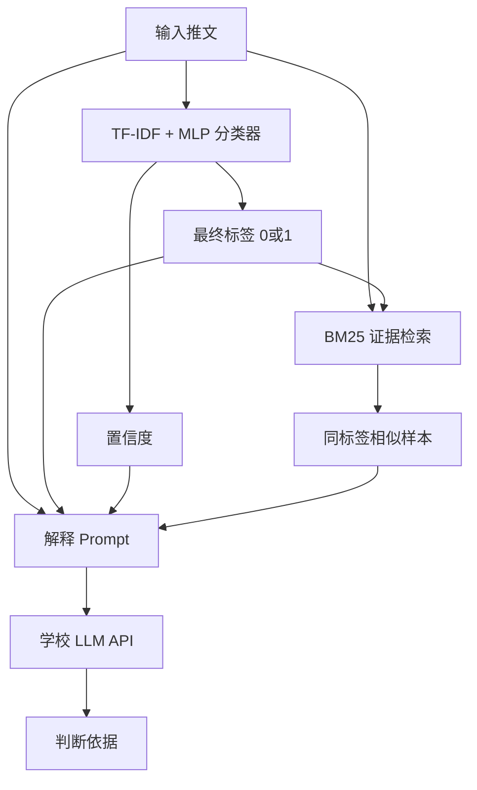

# 2026《人工智能导论》大作业 - 可解释的谣言检测

## 1. 项目目标

对社交媒体推文进行二分类：

- `0`：非谣言
- `1`：谣言

同时输出一段自然语言解释，说明判断依据。

当前最终系统采用 **深度学习分类器 + BM25 证据检索 + 学校 LLM 解释生成** 的复合架构。

## 2. 系统架构



职责划分：

| 模块 | 作用 |
|------|------|
| `neural_classifier.py` | 本地神经网络分类器，负责最终 `0/1` 标签 |
| `bm25_retriever.py` | 检索相似训练样本，只作为解释证据 |
| `detection.py` | 复合模型调度层 |
| `llm_client.py` | 调用学校 LLM API，只生成解释 |
| `run.py` | 完整系统评估入口 |

重要原则：

- **LLM 不参与最终分类**，只解释已经固定的标签。
- **BM25 不投票、不改标签**，避免错误检索样本带偏分类结果。
- 如果训练集中存在完全相同的推文，则走精确匹配捷径。

## 3. 项目结构

```text
AI-Rumor-Detector/
├── data/
│   ├── train.csv              # 训练集
│   └── val.csv                # 验证集
├── results/
│   ├── deep_model_comparison/ # 各深度模型最新对比结果
│   └── prediction_results_*.csv # run.py 完整输出（含解释）
├── bm25_retriever.py          # BM25 证据检索
├── compare_deep_models.py     # 深度模型对比实验
├── detection.py               # 复合模型主逻辑
├── harness_base.py            # Harness 基类
├── llm_client.py              # 学校 LLM API
├── neural_classifier.py       # TF-IDF + MLP 主分类器
├── torch_text_classifiers.py  # TextCNN / BiLSTM 实验模型
├── run.py                     # 完整系统运行脚本
└── requirements.txt           # 依赖列表
```

## 4. 环境部署与安装

### 4.1 基础环境

建议使用 Python 3.10 或 3.12。

```bash
pip install -r requirements.txt
```

当前依赖包括：

```text
requests
pandas
numpy
scikit-learn
torch
```

其中 `torch` 用于运行 `TextCNN` 和 `BiLSTM` 对比实验。如果只跑主系统 `run.py` 或 `tfidf_mlp` 对比，理论上可以只安装前 4 项，但建议直接安装完整 `requirements.txt`。

### 4.2 PyTorch 安装说明

项目已在 `requirements.txt` 中加入 `torch`。常规安装：

```bash
pip install -r requirements.txt
```

如果默认源安装失败，可参考 [PyTorch 官网](https://pytorch.org/) 选择适合你系统的安装命令。例如 CPU 版本：

```bash
pip install torch --index-url https://download.pytorch.org/whl/cpu
```

### 4.3 学校 LLM API

`llm_client.py` 已配置学校 API：

- 接口：`https://models.sjtu.edu.cn/api/v1`
- 模型：`deepseek-chat`

只有运行 `run.py` 时才需要有效 API Key。  
深度模型对比脚本 `compare_deep_models.py` **不调用 LLM**。

## 5. 如何运行

### 5.1 运行完整系统（标签 + 解释）

这是最终提交和展示用的命令：

```bash
python run.py
```

流程：

1. 读取 `./data/train.csv` 和 `./data/val.csv`
2. 用训练集更新 MLP 分类器和 BM25 索引
3. 对验证集逐条预测
4. 每条调用一次 LLM 生成解释
5. 保存到 `./results/prediction_results_时间戳.csv`

输出字段：

- `text`
- `true_label`
- `pred_label`
- `explanation`
- `original_index`

注意：

- 完整验证集约 401 条，受 API 限流影响，通常需要 40 分钟以上。
- `run.py` 中每条样本默认 `sleep(6)`，用于避免触发限速。

当前已保留的完整 `run.py` 结果：

- `results/prediction_results_20260605_213522.csv`
- `results/prediction_results_20260611_191037.csv`

其中 `20260611_191037` 为当前复合模型最新完整结果，Accuracy 为 `0.8653`。

### 5.2 只复现分类准确率（不调用 LLM）

如果只想快速确认分类效果，不生成解释：

```bash
python compare_deep_models.py --models tfidf_mlp
```

这条命令几分钟内完成，结果应接近 `Accuracy 0.8653`。

### 5.3 运行深度模型对比实验

对比脚本**不调用 LLM**，只评估分类性能，适合写报告中的模型对比表。

运行全部默认可比模型：

```bash
python compare_deep_models.py
```

等价于：

```bash
python compare_deep_models.py --models tfidf_mlp,tfidf_mlp_t045,textcnn,bilstm --torch-epochs 8
```

其他常用命令：

```bash
# 只比较 MLP 两个阈值版本
python compare_deep_models.py --models tfidf_mlp,tfidf_mlp_t045

# 只跑某一个模型
python compare_deep_models.py --models textcnn

# 快速小样本测试
python compare_deep_models.py --models tfidf_mlp --max-train-samples 200 --max-val-samples 50
```

### 5.4 对比模型说明

| 模型名 | 含义 |
|--------|------|
| `tfidf_mlp` | 当前主模型，TF-IDF + MLP，默认阈值约 `0.5` |
| `tfidf_mlp_t045` | 同一 MLP，但把谣言判定阈值降到 `0.45` |
| `textcnn` | PyTorch TextCNN |
| `bilstm` | PyTorch BiLSTM |

说明：

- `tfidf_mlp` 与 `tfidf_mlp_t045` 不是两个不同网络，而是**同一个模型、不同判决阈值**。
- `distilbert` 曾在更早的本地实验中测试过，当前仓库未内置其训练脚本，仅在汇总表中保留历史结果。

### 5.5 对比实验输出位置

所有深度模型最新结果统一保存在：

```text
results/deep_model_comparison/
```

主要文件：

- `summary.csv`：各模型 Accuracy / Precision / Recall / F1
- `{model}_predictions.csv`：逐样本预测与概率
- `{model}_fn.csv`：谣言漏判样本
- `{model}_fp.csv`：非谣言误报样本

当前最新对比结果：

| 模型 | Accuracy | F1 | 说明 |
|------|----------|----|------|
| `tfidf_mlp` | 0.8653 | 0.8354 | 当前主模型 |
| `tfidf_mlp_t045` | 0.8628 | 0.8338 | 阈值诊断版 |
| `bilstm` | 0.8429 | 0.8184 | 对比实验 |
| `textcnn` | 0.8354 | 0.8047 | 对比实验 |
| `distilbert` | 0.7955 | 0.7545 | 历史实验结果 |

## 6. 当前版本结果

### 6.1 完整复合系统（`run.py`）

```text
Accuracy:  0.8653
Precision: 0.8954
Recall:    0.7829
F1 Score:  0.8354
```

### 6.2 与旧版的关系

项目经历了两版演进：

| 版本 | 分类方式 | 典型 Accuracy |
|------|----------|---------------|
| 旧版 | BM25 + LLM 直接分类 | 约 0.793 |
| 当前版 | MLP 分类 + BM25 证据 + LLM 解释 | 0.8653 |

当前 Accuracy 指标主要由深度分类器决定，LLM 只负责解释，不参与改标签。

## 7. 结果文件管理约定

为避免 `results/` 目录混乱，当前约定如下：

- `results/deep_model_comparison/`：每种深度模型只保留**一份最新**对比结果
- `results/prediction_results_*.csv`：完整 `run.py` 输出且含 `explanation` 的文件全部保留

## 8. 后续调参还需要做什么

当前系统已经能稳定运行，但如果还想继续提升，建议按下面顺序进行，而不是盲目继续降阈值。

### 8.1 优先级最高：阈值扫描

当前只试了 `0.5` 和 `0.45`。下一步应在验证集上扫描例如：

```text
0.35, 0.40, 0.45, 0.50, 0.55
```

目标：

- 找到 F1 最优阈值
- 或在不明显损伤 Accuracy 的前提下，提高谣言 Recall、降低 FN

注意：

- 阈值越低，越容易判谣言，FN 会下降，但 FP 可能上升。
- 当前结果显示 `0.45` 只比 `0.5` 少漏 1 条谣言，但多误报 2 条，收益有限。

### 8.2 第二优先级：MLP 结构调参

如果阈值扫描收益有限，应继续调 [`neural_classifier.py`](neural_classifier.py)：

- `hidden_layer_sizes`
- `max_features`
- `max_iter`
- `alpha`
- `learning_rate_init`

这比一直调阈值更健康，也更有机会真正提升分类能力。

### 8.3 第三优先级：错误样本分析

建议重点分析：

- `results/deep_model_comparison/tfidf_mlp_fn.csv`
- `results/deep_model_comparison/tfidf_mlp_fp.csv`

当前主要问题是：

- 谣言漏判偏多（FN = 38）
- 一些“指控型、阴谋型、质疑型”推文容易被判成非谣言

可据此增加特征或优化训练策略。

### 8.4 第四优先级：更强深度模型

如果课程环境和时间允许，可继续尝试：

- `distilbert-base-uncased`
- `roberta-base`

但需要额外实现训练脚本，并纳入 `compare_deep_models.py` 的统一输出。

### 8.5 不建议优先做的方向

- 不要让 LLM 重新参与分类，否则会重新引入不稳定性和 BM25 带偏风险。
- 不要让 BM25 重新决定标签，它更适合做解释证据。
- 不要为了在验证集上刷高分数而反复试太多组合，否则容易过拟合验证集。

### 8.6 报告撰写建议

报告里建议分成两层展示：

1. **模型对比层**：使用 `compare_deep_models.py` 的结果，说明为什么选 `tfidf_mlp` 作为主分类器。
2. **最终系统层**：使用 `run.py` 的结果，展示“标签 + 解释”的完整可解释输出。

## 9. 常见问题

### Q1: `0.8653` 还能复现吗？

可以。分类结果主要由 MLP 决定，运行：

```bash
python compare_deep_models.py --models tfidf_mlp
```

应得到相同 Accuracy。  
完整 `run.py` 的标签也应一致，但解释文字可能因 LLM 随机性略有不同。

### Q2: 对比实验要不要加 LLM？

不需要。当前架构里 LLM 不参与分类，所以模型效果对比应使用 `compare_deep_models.py`；完整系统展示再用 `run.py`。

### Q3: 为什么不用 BM25 或 LLM 直接分类？

旧版已经验证过：BM25 检索错误会带偏 LLM，分类不稳定。当前复合架构把分类和解释拆开，更稳、更易复现。

## 10. 参考

- 学校 LLM API 文档：https://claw.sjtu.edu.cn/guide/sjtu-api/
- 复合模型补充说明：[`README_hybrid_model.md`](README_hybrid_model.md)
