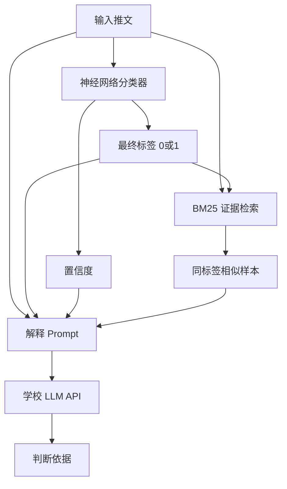

# 复合模型版本说明

本文档说明新版可解释谣言检测架构。原 `README.md` 已保留，用于记录旧版 “BM25 + LLM 直接分类” 方法。

## 1. 总体思路

新版模型采用 **深度学习分类器 + BM25 证据检索 + LLM 解释生成** 的复合架构：



关键原则：

- 最终分类标签主要由本地神经网络分类器产生。
- BM25 不再直接投票或覆盖普通样本标签，只提供相似训练样本作为解释证据。
- LLM 不再负责自由分类，而是在固定标签的前提下生成解释。
- 如果 BM25 证据与神经网络标签不一致，默认过滤掉这些证据，避免错误检索结果带偏解释。

## 2. 文件结构

| 文件 | 作用 |
|------|------|
| `neural_classifier.py` | TF-IDF + MLP 神经网络分类器，负责输出标签和置信度 |
| `torch_text_classifiers.py` | 可选的 PyTorch TextCNN / BiLSTM 实验模型 |
| `compare_deep_models.py` | 深度学习分类器对比实验脚本，不调用 LLM |
| `bm25_retriever.py` | BM25 相似样本检索器，只用于提供解释证据 |
| `detection.py` | 复合模型调度层，组织分类、证据检索和 LLM 解释 |
| `llm_client.py` | 学校 LLM API 调用 |
| `run.py` | 加载数据、训练、评估和保存结果 |

## 3. 深度学习分类器

`neural_classifier.py` 使用 `scikit-learn` 实现一个轻量神经文本分类器：

- 特征：word-level TF-IDF，包括 unigram 和 bigram。
- 特征：char-level TF-IDF，包括 3 到 5 字符 n-gram。
- 分类器：两层 MLP，隐藏层大小为 `(128, 32)`。
- 输出：`label`、`confidence`、各类别概率。

这样做的好处是复现成本低，不需要下载大型 Transformer 模型；同时它仍然是一个带隐藏层的神经网络模型，满足复合模型中“深度学习模型”的要求。

## 4. 深度学习对比实验

`compare_deep_models.py` 用于快速比较不同深度学习分类器。它只评估分类标签，不调用 LLM，因此不会受到 API 限流影响。

默认会比较：

- `tfidf_mlp`：当前主模型，TF-IDF + MLP。
- `tfidf_mlp_t045`：把谣言阈值调到 `0.45` 的诊断版本，用于观察能否降低谣言漏判。
- `textcnn`：可选 PyTorch TextCNN，适合短文本局部模式。
- `bilstm`：可选 PyTorch BiLSTM，用于对比序列建模效果。

基础实验命令：

```bash
python compare_deep_models.py
```

如果没有安装 PyTorch，脚本会自动跳过 `textcnn` 和 `bilstm`，仍然会运行 MLP 相关实验。若只想跑无需额外依赖的实验：

```bash
python compare_deep_models.py --models tfidf_mlp,tfidf_mlp_t045
```

如果安装了 PyTorch，可以运行：

```bash
python compare_deep_models.py --models tfidf_mlp,tfidf_mlp_t045,textcnn,bilstm --torch-epochs 8
```

快速小样本检查：

```bash
python compare_deep_models.py --models tfidf_mlp --max-train-samples 200 --max-val-samples 50
```

输出目录默认为：

```text
./results/deep_model_comparison_时间戳/
```

主要输出：

- `summary.csv`：各模型 Accuracy、Precision、Recall、F1、TN、FP、FN、TP。
- `{model}_predictions.csv`：逐样本预测、`prob_0`、`prob_1`、是否正确。
- `{model}_fn.csv`：谣言被误判为非谣言的样本。
- `{model}_fp.csv`：非谣言被误判为谣言的样本。

## 5. BM25 的新角色

旧版中，BM25 检索结果会直接进入 LLM few-shot prompt，并影响最终分类。如果 BM25 找到的相似样本方向错了，LLM 可能被带偏。

新版中，BM25 的作用被限制为：

- 从训练集中检索与输入推文相似的样本。
- 默认只保留与神经网络预测标签一致的样本。
- 把这些样本提供给 LLM 作为解释参考。

因此，BM25 检索错误通常不会直接改变最终分类。

## 6. LLM 的新角色

LLM 只生成解释，不负责决定最终标签。`detection.py` 中的 prompt 会明确告诉 LLM：

```text
The final label has already been produced by a local neural classifier.
Do not change the label.
```

LLM 输出格式为：

```text
<reasoning>这里是判断依据</reasoning>
```

如果 LLM 调用失败或输出无法解析，系统会生成一段规则化 fallback explanation，保证每条样本都有解释。

## 7. 运行方式

依赖仍然来自原项目：

```bash
pip install -r requirements.txt
python run.py
```

`run.py` 会读取：

- `./data/train.csv`
- `./data/val.csv`

输出仍然保存到：

- `./results/prediction_results_时间戳.csv`

结果包含：

- `text`
- `true_label`
- `pred_label`
- `explanation`
- `original_index`

## 8. 优点与限制

优点：

- 分类更稳定，普通样本不再由 BM25 或 LLM 直接决定标签。
- 保留 LLM 的自然语言解释能力，满足可解释输出要求。
- 保留 BM25 的相似案例检索能力，但降低其错误传播风险。
- 不额外依赖大型模型下载，适合课程环境复现。

限制：

- MLP 使用 TF-IDF 特征，语义理解能力弱于微调 BERT/RoBERTa。
- LLM 解释仍可能存在事后合理化，需要在报告中说明其解释是辅助性依据。
- 每个验证样本仍需调用一次 LLM 生成解释，完整评估速度受 API 限流影响。
- 第一次预测前会训练 MLP，因此首个预测会比后续预测慢。

## 9. 后续可改进方向

- 若运行环境允许，可将 `NeuralRumorClassifier` 替换为微调后的 `bert-base-uncased` 或 `roberta-base`。
- 对低置信度样本单独标记，报告中分析这些样本的错误类型。
- 对 LLM 解释增加更严格的模板，例如要求说明“文本线索、相似案例、模型置信度”三部分。
- 缓存训练好的神经分类器，避免每次运行都重新训练。
